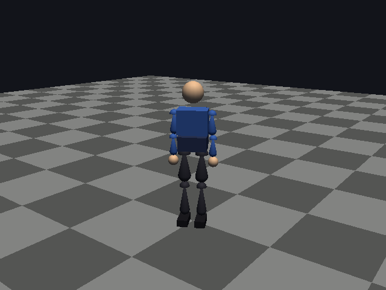
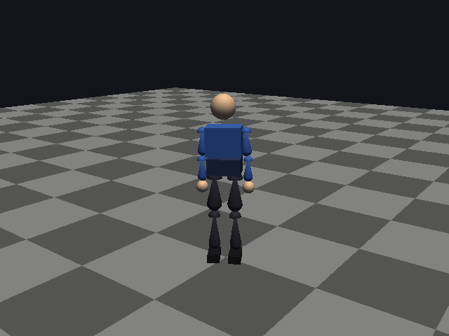
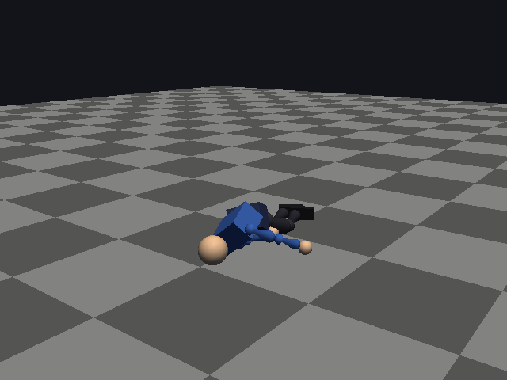
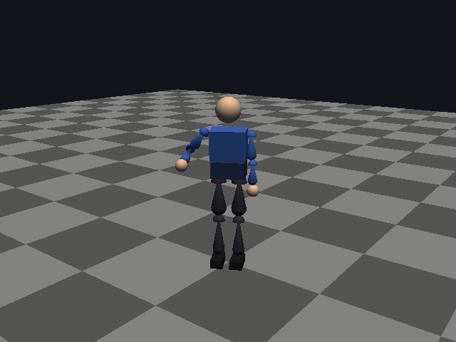
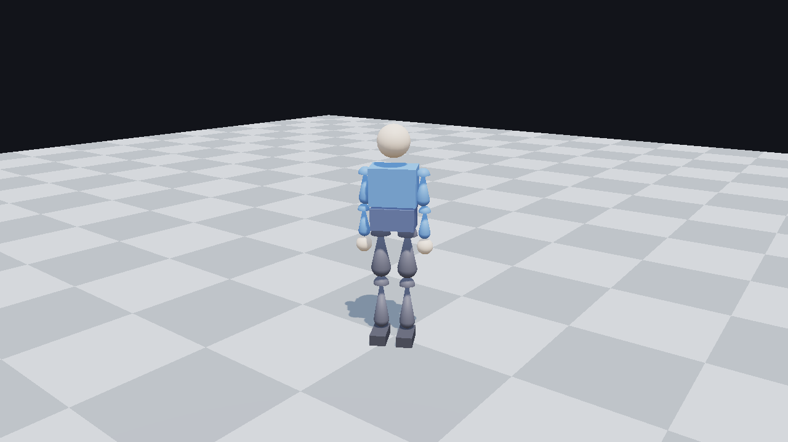

# engine - 3D-движок на FreePascal

Движок на FreePascal с OpenGL 4.3 core и GLFW 3. Классов и объектов нет, исключения не используются: данные - записи, поведение - процедуры, ошибки печатаются в stderr с завершением через `Halt`. Состав: столкновения GJK + EPA, физика твёрдых тел, анимация, рэгдолл-поведения (приближение Euphoria), рендерер GL 4.3, снимок экрана в PNG, программный растеризатор для проверки без GPU.

**Что проверено на стенде:** тесты (114 проверок), бенчмарк, сборка всех модулей, программные снимки поз. **Что не проверено:** окно и GL-рендерер (на стенде нет GPU и дисплея), сборка для Windows и открытие проекта Lazarus.

## Состав и статус

| Подсистема | Модули | Статус |
|---|---|---|
| Математика | `src/engine/EngMath.pas`, `EngMat4.pas` | готово, протестировано |
| Столкновения GJK + EPA | `src/engine/EngConvex.pas` | готово, протестировано: сфера, капсула, бокс, выпуклая оболочка; бокс-бокс сверяется с SAT |
| Физика твёрдых тел | `src/engine/EngPhysics.pas` | готово, протестировано: последовательные импульсы, трение, шарниры ball и hinge с приводами и пределами, эффекторы |
| Анимация и гуманоид | `src/engine/EngAnim.pas`, `EngHumanoid.pas` | готово, протестировано: скелет, клипы, кроссфейд, двухкостный IK |
| Рэгдолл (приближение Euphoria) | `src/engine/EngRagdoll.pas` | работает: баланс в стойке, упор при толчке, дотягивание рукой. Не клон Euphoria |
| PNG | `src/core/EngPNG.pas` | готово, протестировано; без сжатия (deflate stored) |
| Рендерер OpenGL 4.3 | `src/render/EngRender.pas`, `EngMesh.pas`, `shaders/` | написан; шейдеры проверены `glslangValidator`; **не запускался** |
| GL и GLFW (собственные загрузчики) | `src/platform/GLBind.pas`, `GLFWBind.pas` | написаны; **не запускались** |
| Снимок окна (метод lencerf) | `src/platform/EngScreenshot.pas` | написан; **не запускался** |
| Снимки поз через OpenGL 2.x (OSMesa) | `src/render/EngFixedGL.pas`, `src/platform/OSMesaBind.pas`, `GLFixedBind.pas` | работает при наличии osmesa-main (см. `docs/OSMESA.md`); без теней и GGX |
| Приложение и запуск | `src/app/EngDemo.pas`, `examples/Demo.pas` | собирается; без GLFW возвращает код 2 (проверено) |
| Windows и Lazarus | `build_windows.bat`, `lazarus/EngineDemo.lpi`, `lazarus/EngineDemo.lpr` | написаны; **не проверены** (нет Windows и кросс-компилятора) |

## Быстрый старт

```sh
./build.sh                  # тесты: 114 проверок при наличии osmesa-main (ENGINE_OSMESA), иначе 111; код 0 - все прошли
./build.sh bench            # тесты и бенчмарк
./build.sh examples         # примеры и инструменты
./build/examples/PoseSnapshot --osmesa libosmesa.so out   # снимки поз через OpenGL 2.x (osmesa-main) -> out/pose_*.png
./build/examples/Demo --frames 120 --shot out/demo.png  # окно GLFW (нужны GLFW 3 и OpenGL 4.3)
```

Компилятор: FreePascal 3.3.1-dev, собранный из исходников коммита `db4bc06b` (см. `docs/TOOLCHAIN.md`). `build.sh` берёт `~/.local/fpc-3.3.1-dev/bin/fpc`, если он есть, иначе `fpc` из PATH. Переменная `FPC` задаёт другой компилятор, `FPC_CPU_OPTS=""` отключает AVX2.

## Скриншоты

Галерея с подписями и командами, которыми сняты кадры: [docs/SCREENSHOTS.md](docs/SCREENSHOTS.md).

<table>
<tr>
<td><br>Стойка</td>
<td><br>Толчок 80 Н·с, снимок через 1 с</td>
</tr>
<tr>
<td><br>Падение после толчка 150 Н·с</td>
<td><br>Дотягивание правой кистью</td>
</tr>
</table>

<br>OpenGL 4.3 (шейдеры, тени, GGX) через Mesa 21 softpipe: программно, на GPU не проверено

## Структура

```
src/core/       PNG (без зависимостей)
src/engine/     математика, GJK/EPA, физика, анимация, гуманоид, рэгдолл
src/platform/   загрузчики GL, GLFW и OSMesa, снимок экрана
src/render/     геометрия, рендерер OpenGL 4.3, снимки OpenGL 2.x (EngFixedGL), описание сцены (EngScene)
src/app/        приложение EngDemo (общее для примера и Lazarus)
shaders/        GLSL 4.30 core: меш, тени
tests/          набор проверок (TestMain и модули TestKit, TestPhysics, TestRagdoll, TestPNG, TestRender)
bench/          бенчмарк BenchMain.pas
examples/       Demo.pas (окно)
tools/          PoseSnapshot.pas (снимки поз), tools/fpc/ (сборка FPC из исходников)
lazarus/        проект Lazarus
docs/           архитектура, физика, бенчмарк, Windows, тулчейн, OSMesa
```

## Документация

- [docs/ARCHITECTURE.md](docs/ARCHITECTURE.md) - слои, зависимости, поток данных кадра, графика.
- [docs/PHYSICS.md](docs/PHYSICS.md) - GJK/EPA, физика, анимация, рэгдолл, что проверено.
- [docs/BENCHMARK.md](docs/BENCHMARK.md) - методика, результаты, узкие места.
- [docs/WINDOWS.md](docs/WINDOWS.md) - сборка для Windows, Lazarus, коды возврата.
- [docs/TOOLCHAIN.md](docs/TOOLCHAIN.md) - сборка FPC из исходников и журнал проверки.
- [docs/OSMESA.md](docs/OSMESA.md) - OSMesa без окна: osmesa-main (OpenGL 2.x) и Mesa 21 (OpenGL 4.3 softpipe).
- [docs/SCREENSHOTS.md](docs/SCREENSHOTS.md) - скриншоты с подписями и командами, которыми они сняты.

## Результаты (стенд: 2 vCPU Xeon 2.6 GHz, виртуальная машина, один поток)

| Сценарий | Время |
|---|---|
| Бокс-бокс, GJK + EPA | 7.9 мкс на пару |
| Стопка 400 коробок, шаг 1/240 с | 4.7 мс на шаг (медленнее реального времени) |
| Рэгдолл в стойке, кадр 1/60 с | 0.37 мс на кадр |
| Анимация 15 костей | 2.9 мкс на кадр |
| PNG 1280×720 | 14 мс на кадр, файл без сжатия 2.6 МБ |

Полная таблица и выводы: [docs/BENCHMARK.md](docs/BENCHMARK.md). Числа зависят от железа.

## Ограничения

- Окно, GL-рендерер и шейдерный путь не запускались: на стенде нет GPU и дисплея. Шейдеры компилируются `glslangValidator`, модули собираются, код окна проверен только на путь без GLFW (код 2).
- Снимки в `out/pose_*.png` сделаны через OpenGL 2.x в osmesa-main (фиксированный конвейер): без теней и GGX, освещение Блинна-Фонга. Это вывод OpenGL, но не шейдерный путь GL 4.3. Файлы PNG исключены из git (`.gitignore`), они лежат в рабочем каталоге.
- Путь GL 4.3 (`EngRender`) на osmesa-main не запускается: в нём только OpenGL 2.0. Шейдеры GL 4.3 в программном виде проверяются через Mesa 21+ (режим `--offscreen`, см. `docs/OSMESA.md`).
- Рэгдолл - приближение поведений Euphoria (баланс, упор, дотягивание). Походки, реакций на препятствия и полного совпадения с NaturalMotion нет.
- Плотные стопки медленные. Оптимизация физики не завершена; AVX2 на этом коде не дал выигрыша.
- PNG пишется без сжатия, поэтому файлы большие.
- Сборка для Windows и проект Lazarus не проверены.
- Официальный FPC 3.2.2 не собран: цепочка 3.0.4 -> 3.2.0 -> 3.2.2 не сошлась (см. `docs/TOOLCHAIN.md`).
- Привязки GLFW и GL собственные (загрузка функций по указателям). Готовых привязок, которые упоминались в задаче, на стенде не нашлось.
